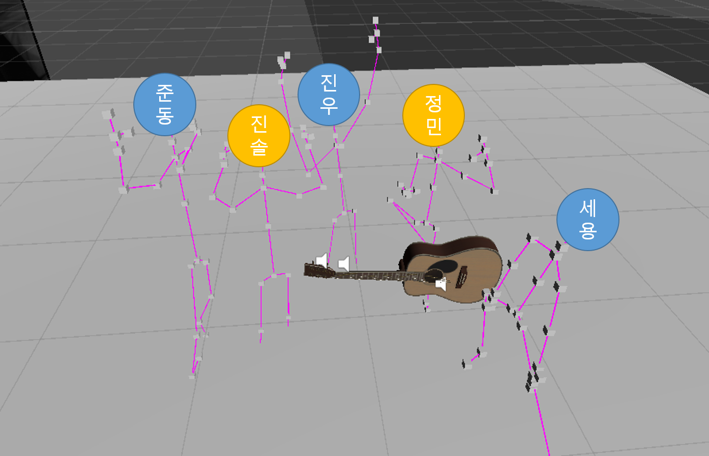

# 프로젝트 소개

> 악기들을 연주하고 싶지만 여건이 안되는 사용자들에게  AR 기반의 프로그램을 통해 악기를 연주할 수 있는 환경을 제공함으로써 시간과 공간의 제약없이 연주를 할 수 있게 한다.
> 또한, 웹서비스를 통해 본인 연주 동영상을 업로드하여 타인의 연주와 병합하는 창작의 즐거움도 제공한다.
>
> 1) AR 환경을 조성하여, 사용자가 모니터를 통해 증강현실에 구현된 악기를 보며 연주를 한다.
>
> 2) 연주자는 타악기(percussion instruments: 드럼, 마림바 등) , 현악기(strings: 일렉 기타, 어쿠스틱 기타, 베이스 등) 키트, 또는 건반악기(clavier: 피아노, 신디사이저 등)키트를 선택(구매)하여 웹사이트에서 소프트웨어를 다운받는다.
>
> 3) 연주자는 모니터를 통해 악기와 연주를 하는 자신의 모습을 보며 연주를 할 수 있다.
>
> 4)연주자는 녹화 기능을 통해 본인이 연주한 곡을 녹화하여 본인 PC에 저장할 수 있고, 원하면 웹서버에 저장된 곡을 올려 공유, 병합을 할 수 있다.

## 팀원 소개

> 김세용 김준영 김진우 유진솔 김정민

